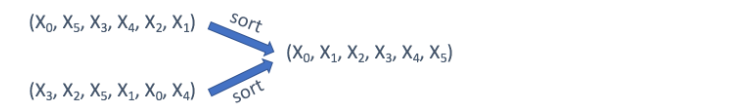
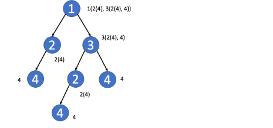
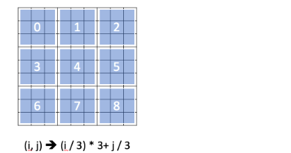
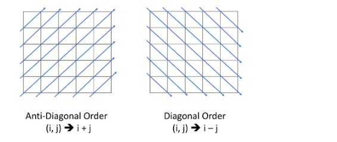

Design the Key - Summary  

Here are some takeaways about how to design the key for you.  

1. When the order of each element in the string/array doesn't matter, you can use the sorted string/array as the key.  

2. If you only care about the offset of each value, usually the offset from the first value, you can use the offset as the key.  

3. In a tree, you might want to directly use the TreeNode as key sometimes. But in most cases, the serialization of the subtree might be a better idea.  

4. In a matrix, you might want to use the row index or the column index as key.  

5. In a Sudoku, you can combine the row index and the column index to identify which block this element belongs to.  

6. Sometimes, in a matrix, you might want to aggregate the values in the same diagonal line. 
